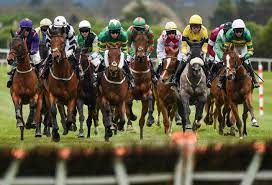

# ***TRAIN AN ALGORITHM TO ANALYZE HORSE RACING DATA AND PREDICT FUTURE TRENDS***

## TEAM MEMBERS
Arshad Sheikh (AS) 
Choki Mafavuke (CM)
Maxwell Ansah (MA1)
Muhammad Amjad (MA2)

## PROJECT OUTLINE
The aim is to download data in the form of a csv file that provides us horse racing data over 14 years fr the UK and ROI. 
The aim is to clean the data, utilizing columns that we need and uploading to a SQL database. 
We will use maching learning models to analyse and predict the trends.

## DATA SOURCES
Kaggle : all_races05_19

## ROUGH BREAKDOWN OF TASKS
AS - data cleaning, coding,
CM - data cleaning, coding,
MA1 - data cleaning, coding,
MA2 - data cleaning, coding,
